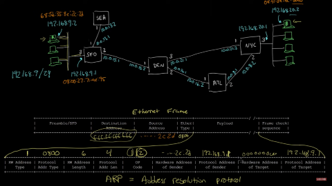
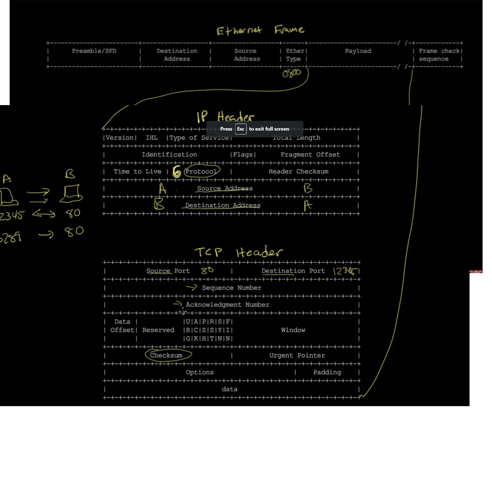
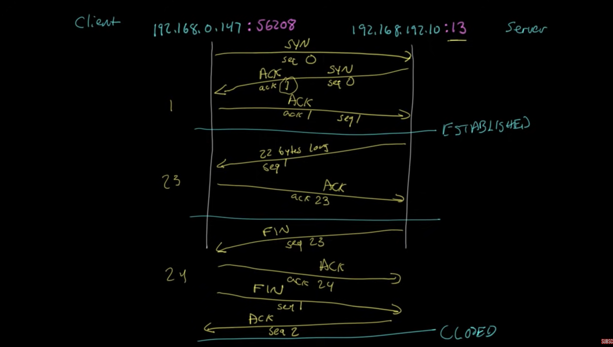

# OSI Model

> [Click here](https://youtube.com/playlist?list=PLowKtXNTBypH19whXTVoG3oKSuOcw_XeW) to go the actual playlist of **Ben Eater**.
> All of the notes are from his videos (including screenshots).
> Thanks **Ben** for such a great content!

- OSI model stands for Open System Inter-connection model

## Physical layer

1. **Ethernet cable** has 4 pairs of wires (total 8 different wires)

   - 1 bod = 1 symbol/sec.
   - We send info over copper wire by varying volatages.

2. **Fiber Optics** works on the principle of total internal reflection. Here as well we can say **0** is light on and **1** is light off.
3. **Radio Waves** can also be used for sending information. Shifting phases of waves can help in sending 0s and 1s.

---

1. **Clock synchronization** is very important while transferring data over a network
2. **Clock slip** is the phenomenon when clocks are out of sync and we read some extra or some less bits which corrupt our message

Ways to sync clocks:

- Use GPS
- Embed atomic clocks
- Send a clock signal for syncing
- In practice, we use **Manchester coding**:

  - First sync clocks via signal
  - Then use transitions instead of absolute values. For example if 0V was 0 and 5V was 1 before, now we are saying that transition from 0V to 5V is 1 and transition from 5V to 0V is 0
  - So even if the receivers clock isn't perfectly synced it can still read the incoming data properly

---

## Data Link Layer

### Point to Point Data Link

Data is shared b/w two computers connected at the two ends of an ethernet cable or fibre optic cable.

**How does the receiver know the byte boundry?** *Framing* is the answer.

#### HDLC Framing Format

In HDLC (High Level Data Link Control) protocol we use **0111110** as a flag to indicate that a new frame starts after it. So the receiver knows that the first byte starts after this flag

If the actual data contains five 1's in consecutive, **bit stuffing** is performed. So in order to prevent the receiver from mistakingly mis-interpretting the data as flag, 0 is inserted after the four 1's and the receiver is expected to ignore it

> Ethernet has a different mechanism. **Inter-frame gap (IFG)** is a gap when there is no data sent (0V in case of wire) and then it sends **Preamble** which is a 56 bits long alternating 0's and 1's.
    - Something like this: -------[IFG]--------1010101010...101011
    - The last 11 informs the receiver that after this 11 the upcoming bit is data
> Large frames mean efficiency but if receiver misreads some byte then it will misread everything after that until new frame starts.
> Ethernet Frame sizes vary from **64-1500 bytes** usually.

#### PPP (Point-to-Point) Framing Format

PPP uses the same HDLC framing. There is flag byte (0111110) at the beginning.

We don't need address field as it Point-to-Point data link. So mostly address is set to 0xff

Also control has no use and set to 0x03

Protocol, Payload, and FCS  are equivalent to Ether Type, Payload and Frame Check Seq of ethernet

<!-- TODO: Add image of PPP format -->

---

### Multipoint/Broadcast Data Links

#### Ethernet Framing Format for Multipoint Data Links

For example multiple computers connected via radio waves or ethernet cable

- Ethernet/MAC addresses are builtin in all Ethernet interfaces
- **Source addr** and **Dest addr** hold MAC addr of sender and receiver respectively
  - Setting destination address to ff:ff:ff...:ff in hex informs that it is a Broadcast i.e for every computer
- **Ether Type** gives us what type of data are we expecting in **Payload**. In most cases it is going to be an IP packet.
- Last 4 bytes consist of **Frame Check seq.** It is a number computed on the basis of everything the frame contains (from dest addr to payload). It lets the receiver know if there has been any corruption of data along the way.

<!-- TOOD: Add image of ethernet -->

---

## IP

We cannot use a mac address over internet because sometimes the routers are linked via PPP LLC (Point to Point Logical Link Control) and as we know they don't use mac address.

So to overcome this issue a standard protocol (set of rules) called IP came into existance. Internet Protocol Address is a unique address given to every computer connected to the Internet.

Routers receive packets at each of their interefaces and make a dicession of where to forward those packets. Every router has a forwarding table which tells the router where to forward a packet with pariticular IP addr.

The process of building that table is called **Routing** and the process of using this table to forward the packets is called **Forwarding**

Instead of actual IP's, the router stores ranges of IP's to improve effeciency. For example

    - There is something like 172.8 / 16 > 88.112.32.2 (Kashmir) in routing table
    - This means that if dest ip addr of packet's first 16 bits match to 172.8 then forward it to Kashmir router with IP 88.112.32.2

## Mapping IP and Ethernet (ARP)

When we want to send a packet to a computer which is not on the same LAN, we send it to the local router with the IP addr of the receiving computer.

    - Dest Mac addr is Routers addr
    - Src Mac addr is Senders addr
    - Dest IP addr is receivers addr
    - Source IP addr is sender ip addr

---

- How does sender know which host he needs to send?
When a sender wants to send a particular packet to some computer it first checks if the computer is on the same network by looking at the receiving IP addr and subnet mask.

If the computer is not on the same network then it sends a request asking who has IP addr xxx.xx.xx.xx (ip addr of router). The dest mac addr of this req is broadcast addr or fffffffffff and all computers look at the request but only router responds with its mac addr because it has the given IP addr.

For this request we use `ARP (Address Resolution Protocol)` (code 0806). So the ether type of this ethernet frame is ARP request.

> ARP is the protocol that lets us do mapping b/w addr (mostly IP addr) and hardware addr (mostly MAC addr)

First four slots are almost always by the same values.

  1. **HW Addr Type**: Which hardware addr are you req? MAC addr
  2. **Protocol Addr Type**: Which protocol addr are you req? IP addr
  3. **HW Address Len**: Length HW addr
  4. **Protocol addr Len**: Length of protocol addr
  5. **OP Code**: Which operation? 1 for req and 2 for ans
  6. **Hardware Addr of sender**: Mac addr of req
  7. **Protocol Addr of sender**: IP addr of sender
  8. **Hardware Addr of Target**: 000000000 (as it is request)
  9. **Protocol addr of Target**: IP addr of router

Respond of router is also a ARP answer with its MAC addr as HW addr

> Subnet mask: Prefix of ip addr shared by your LAN

After receiving routers mac addr, we send the packet with the dest mac addr of router but with ip addr of the receving party. After that routers forward the request until it reches the receving party.

## IP Packet

Payload of ethernet frame contains almost (always?) an IP Packet.

Now in IP Packet there is IP Header and IP Payload. When using ping this IP Payload contains an ICMP Message.

This is called Encapsitlation. Ethernate frame encapsilates IP Packet which encapsilates ICMP Message and so on.

IP Packet Structure:
- **Options** is almost never used and thus IHL (IP Header Len) is almost always 5
- **Type Of Service** is used to prioritize the traffic (Not used mostly except in intercommunication b/w routers)
- **Time To Live** is an 1 byte number that is set by the sender and each router decrements it by 1. If it becomes 0, packet is discarded.
  - Prevent loops
- **Protocol** tells us about data in payload. In ping messges it is 1 i.e ICMP Message
- **Header checksum**, same as FCS (Frame Check Seq) of ethernet frame
- **Source addr**, ip addr of sender
- **Dest addr**, ip addr of receiver

Working of routing table:
- **\>** indicates the next router where router has to send its packet based on the dest ip addr
- **metric #** is the number of hops to reach to dest ip addr. It kind of tells the distance from the target machine
- **[Direct]** means that the router is directly connected to the ethernet of the target computer. There is no remaining router b/w this router and target computer.
-  **em2.0** means forward the message through interface 2 of router

## TCP

There is a limitation in how much data can be sent (~1500 bytes) in a single packet of IP

So we split out data in multiple packets.

Challenges with splitting into packets
  1. **Packet Loss**
  2. **Retransmition**: e.g incase recevier didn't receive any packet
  3. **Reordering**
  4. **Multiple conversations**: e.g while sending multiple files
  5. **Control flow**: e.g when one computer sends packets at faster rate than the receving computer can handle.

TCP solves all the above problems by providing **Byte Stream Service** which is connection oriented and reliable.
  - **Connection Oriented** means that before even sending data, both computers establish a connection. Just like a phone call
  - **Byte Stream Service** means that once the connection is established the sender sends just throws up the bytes it wants to send and tcp handles all the packeting and stuff. Sender at this point just assumes that the bytes will appear at the other computer.
  - It is **reliable** by sending and ACK packet to the sender when receiver successfully receives data.

> 6 is the protocol number for tcp

TCP Header:

1. **Source Port** and **Dest Port**: Multiple conversations.
   - TCP Connections are bidirectional
2. **Checksum**: Provides checksum of the TCP header
3. **Seq Number**: For every byte, seq number is incremented. Helps in reordering and detecting lost or duplicate packets
4. **Ack Number**: After receving data, recevier sends an ack num. This number represents the next seq number the receiver is expecting. This helps the sender to verify if the prev data was successfully recevied by the receiver

> The **seq number** is the byte number of first byte of data that is in the current packet. The **ack number** is the byte number of first byte of data that receiver is expecting to receive.

> Client: Computer that is connecting to another computer
> Server: Comptuer that client is connected to
> Once the connection is established, there is no server and client because both can send and receive data
 
### Connection example

What are we going to do?

Client connects to server. When it connects to server at port 13, server is programmed to send current data and time which 22 bytes long data and then closes the connection.

**CONNECTION ESTABLISHMENT**:

1. Client sends the tcp packet with random seq number.
 
  - To inform that this packet is for establishing connection, client sets the SYN bit (Synchronize bit). TCP has different flag bits for different things.
  - For simplicity, lets say seq number was 0. So the client is expecting 0th byte from server.

2. Server responses with ACK bit set with ack number as 1. That is the server has received 0th byte of data and expecting 1st byte of data from the client (It has incremented the seq number sent by client).
   
   - In the same packet, server sets SYN bit and picks a random seq number (say 0). That is server is sending the 0th byte of data

3. Client responses with ACK bit set and both ack and seq number are set to 1. So client is saying that it has received 0th byte and is expecting 1st byte and also it is sending 1st byte as requested.

At this point the connection has been successfully establised. Notice that no data has been sent so far.

---

**SENDING DATA**

1. Server is programmed to send the 22 bytes data. So it sends a packet with seq 1 i.e it says that this packet is containing 22 bytes of data whose first byte is 1st byte of total data.
   - if for example seq number was 87 then it meant that the server is sending 22 bytes whose first byte is 87th byte of the total data.
2. Client sends a response with ACK bit set and ack number 23rd. It means that client is expecting 23rd bit of total data and that it has recevied 22 bytes correctly

Now data has been completely transmitted and the server prepares to close the connection

---

**CLOSING CONNECTION**

1. Server sends a tcp packet with FIN bit (final bit) and seq number 23rd.
   - It means that the server is closing connection and the packet contains the 23rd byte of total data.
2. Client sends a tcp packet with ACK bit and ack number as 24.
3. Client sends another packet with FIN bit and seq number as 1
4. Server sends a tcp packet with ACK bit and seq number as 2

At this point the connection is completely closed.

