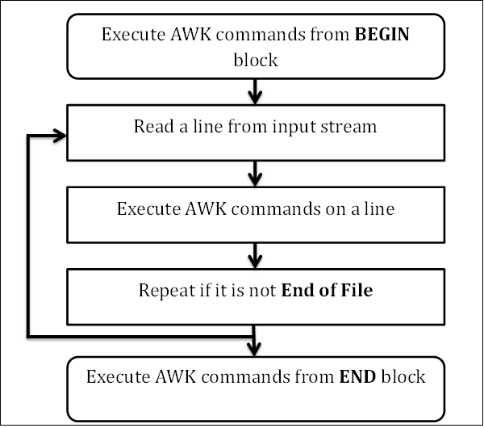

# General Linux

## Patch and Diff

```bash
# generate patch file
diff -ur dir_org dir_new > dir.diff

# apply patch
patch < dir.diff

# undo the applied patch
patch -R < dir.diff
```

- If env is too different for patch then it will fail
    - It will give you two files: *.rej and *.org


### Diff:

- `diff [original] [changed]`
- `diff` tool calcs the difference b/w files which is called `patch`
- First line contains lines that differ
- `<` for orignal and `>` for changed
- `-r` recursive
- `-x PATTERN` exclude files that match PATTERN
- `diff3 file1 file2 file3` compare 3 files/dirs

### Patch:

- `patch [orginal] [patchfile]` or `patch < [patchfile]`
- `-b` make backup of original files

## Data manipulation

### Head and Tail

#### Head

- `head -19 file` prints first 19 lines
- `-n NUM` read first n lines
    - If NUM is -ve then print all except for last NUM lines
    - NUM can have suffix like K (1021) and kB (1000). 4kB means 4000

#### Tail

- `tail -19 file` prints last 19 lines
- `-n NUM` read last n lines
  - if NUM is followed by + (e.g +4) then output every thing from NUM line (inclusive)
  - NUM can have suffix just like in head
- `--retry` keep trying to open file
- `--follow, -f` output appended data (useful in logging)


### AWK

#### Work Flow:



#### Format:

```awk
BEGIN {awk-commands} # BEGIN block

/pattern/ {awk-commands} # BODY block

END {awk-commands} # END block
```
#### Basics
- `FS` represents separator and by default is **space**. `-F` option can be used to change it
- $0 represents whole line/record
- $1 represents first word/field, $2 represents second word/field and so on
- `awk -f program.awk input_file.txt` runs the awk script **program.awk** on input_file.txt
- `--dump-variables` dumbs all variables in awkvars.out
- `--lint` provide lints 
- `--profile` generate pretty-printed version of the program you wrote on command-line
- `-F SEP` changes values of `FS` variable. FS variable represents the seperator which is by default **space**

#### Variables

- `ARGC` and `ARGV` contain arg count and args respectively
- `FILENAME` contains name of file
- `NF` represents number of fields in current record
- `NR` represents number of current record. For first record/line it is 1 then 2 and so on

#### Regexp

- `[^CT]all` matches Xall execpt Call and Tall
- `Call|Ball` matches Call or Ball
- `Colou?r` matches Colour and Color
  - ? Zero or more
  - \+ One or more

Examples:
```bash
awk '{print}' file    # Print all lines/records
awk '{print $0}' file # Print all lines/records
awk '{print $1}' file # Print first word/field of each line
awk '/^wow/ {print $2}' file         # Print 2nd word of each line which starts with wow
awk -v name=Junaid '{printf "Your name is %s", name}' file # Prints Your name is Junaid
awk '{print length($2) >= 18 }' file # Print those lines where 2nd column/word has 18 or more letters

# Prints number of times a junaid is found in the file
# Count is increamented when pattern match succeeds
awk '/junaid/{++count} END {print "Count: ", count}' file

# String cancatination
awk 'BEGIN {str1="Hello"; str2=", "; str3=str1 str2 "World"; print str3}'
```

## netcat/nc

Switches:
  - `-l`: Listen for incoming connections
  - `-v`: Verbose
  - `-p ####`: Port
  - `-w SEC`: Timeout. IMP
  - `-n`: Don't resolve. Provide IP instead of domain
  - `-e STR`: Execute commands
  - `-z`: Port scan

1. Range of ports can also be used