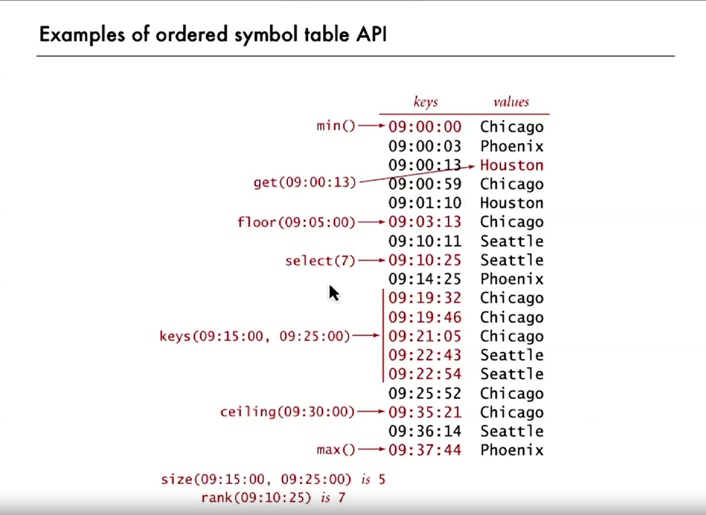

# DSA Concepts

- [DSA Concepts](#dsa-concepts)
  - [Time complexity](#time-complexity)
  - [Taking intersection of two ranges](#taking-intersection-of-two-ranges)
  - [DFS and BFS](#dfs-and-bfs)
    - [BFS](#bfs)
    - [DFS](#dfs)
  - [Backtracking](#backtracking)
  - [Recursion](#recursion)
    - [Structure of recursive function](#structure-of-recursive-function)
    - [Divide \& Conquer](#divide--conquer)
  - [DP](#dp)
    - [Memoization](#memoization)
    - [Bottom-up approach](#bottom-up-approach)
      - [Tips for converting solution from recursive to bottom-up](#tips-for-converting-solution-from-recursive-to-bottom-up)
      - [When is it 1D and 2D DP problem?](#when-is-it-1d-and-2d-dp-problem)
  - [Dynamic Programming](#dynamic-programming)
  - [How to identify a DP problem?](#how-to-identify-a-dp-problem)
    - [Tabulation](#tabulation)
  - [Greedy Algorithms](#greedy-algorithms)
  - [Trie](#trie)
  - [Priority Queue](#priority-queue)
    - [Heap](#heap)
    - [Binary Heaps](#binary-heaps)
      - [Binary Heap Properties](#binary-heap-properties)
      - [Heap Operations](#heap-operations)
    - [Heap Sort](#heap-sort)
  - [Symbol Table](#symbol-table)
    - [Elementary Implementations of symbol table](#elementary-implementations-of-symbol-table)
      - [LinkedList](#linkedlist)
      - [Ordered Symbol Table](#ordered-symbol-table)
    - [Efficient Implementations](#efficient-implementations)
      - [Binary Search Trees](#binary-search-trees)
        - [Ordered Symbol Table Opts using BST](#ordered-symbol-table-opts-using-bst)
        - [Deletion cost (BST)](#deletion-cost-bst)
  - [Merge Sort](#merge-sort)

## Time complexity

- Usually denoted by O(n) where the n = input size
- Before calculating time complexity be sure to ask the case
  - Worst case (mostly)
  - Best case
  - Average case (real world case)
- [Big O Cheatsheet](https://www.bigocheatsheet.com/)
- For each line ask, how will the runtime increase as input approaches infinity.
- If by doubling size of input the runtime increases by 1 then the time complextiy is `O(log2 n)` or simply `O(log n)`.

> e.g: O(n) means that some number of computations are performed on each element of input

- In list of python:
  - len => O(1)
  - append => O(1)
  - get slice => O(k)
  - set slice => O(k+n)

> Because n is used to represent number of elements in input array, k is used to represent the
> number of elements to be sliced here.

## Taking intersection of two ranges

```java
int[] range1 = {10, 30};
int[] range2 = {15, 20};
int[] intersection = new int[2];
intersection = Math.max(range1[0], range2[0]);
intersection = Math.min(range1[1], range2[1]);
```

## DFS and BFS

### BFS

1. You can start from any vertex
2. While exploring vertex, you can visit adjacent vertex in any order
3. `RULE1`: While exploring vertex, visit all its adjacent vertices and add them to queue
4. `RULE2`: Next vertex for exploration should be chosen from **Queue**

> If graph has cycles use visited array
> In bfs we first explore all nodes at distance 0 from source then all nodes at distance 1 and so on. Thus bfs guarantees that the first path you find will be the shortest path.

### DFS

1. You can start from any vertex
2. **Stack** is used

> Add current vertex to stack only when you are about to start the exploration of another vertex i.e when you are about to suspend current vertex for later

## Backtracking

1. Def: Find all possible solutions and use the one you want
2. Tree visualization helps in solving backtracking problems
   1. Continue one branch of tree
   2. Once you reach end i.e you find your answer , backtrack to solve previous branch
      1. You backtrack whenever your method returns. So whenever you define a base condition in recursion, you are actually backtracking

## Recursion

1. Tradeoff: Calling method is slow than looping
2. **Call Stack:** IT IS A _STACK_. Don't forget that

### Structure of recursive function

- Three Questions:
  1. **What is base case?**
     - What will you pass the function so that it returns immediately? That should be your base case
     - It should be such that you don't even do a single piece of work.
       - e.g empty string, 0 length array
  2. **What is smallest amount of work u can do in the problem?**
  3. **With every function call, make sure to shrink the input**
- Five Questions (Based on finding sum of first _n_ natural numbers):
  1. Find base case
  2. Play around around examples and visualize
  3. Relate hard cases with simpler cases
     - If you have to sum first 5 natural numbers. Ask if i was given sum of 4 numbers can i find sum of 5 numbers?
  4. Generalize the pattern.
     - If sum of first n-1 is given, can i find sum of n numbers?
  5. Code the solution

> **Recursive leap of faith**, assume that the answer of easier/smaller problem's answer will be correct. For example assume that sum(n-1) is correct and then work your way out

### Divide & Conquer

3 Steps:

1. Divide the problem into smaller subproblems.
1. Conquer the subproblems by solving them recursively
   **Solve small enough problems by bruteforce**
1. Combine bruteforce solutions to get solutions of subproblems and then finally solution to orignal problem

> e.g: Merge Sort

## DP

Dynamic programming is a technique for solving problems.

In any dynamic programming problem, what's important is that our problem must be **breakable** into smaller subproblems and also, these subproblems show some sort of **overlap** which we can save upon by **caching** or **memoization**.
Three steps:

1. **Recursion:** Solve with recursion
2. **Memoization:** Store values if too much recursion
3. **Bottom-up:** Remove recursion

DP -> Recursion + Memo + Guessing

> TIP: First make a working solution using **pure recursion** then make it efficient using **memoization**

### Memoization

- Conversion of any **recursive function** into **memoized recursive function**
  - Check if args in memo. Return if present
  - Save return value
- MISTAKE: Don't check cache for the recursive calls you are gonna make in case your functions args were not cached.
  - They will handle themselves as well

```java
// recursive function
function(a, b, c) {
    ...
    return ans
}
```

```java
// memoized recursive function
memo = {}
function(a, b, c) {
    if((a,b,c) in map)
        return memo[a,b,c]
    ...
    memo[a,b,c] = ans
    return ans
}
```

> time = sub-problems \* (time/subproblem)
> Don't count memoized recursive calls

- Memoization recipe:

  1. Make it work
     1. Visualize problem as a tree (break large problem into smaller ones)
        - Tree nodes (circles) represent input or the input that is changing over time and line may be output
     2. Implement tree into recursive code
        - Leaf nodes are base cases
     3. Test it (it can be slow but should be working)
  2. Make it efficient
     1. Add a memo object
        - **Keys** represent arguments of function
        - **Values** represent return values of function
     2. Add a base case for memo object
     3. Implement memo storing logic i.e store return value

- Calculating time complexity and space complexity of recursive solution (without memo)
  1. For **Binary Tree**:
     - Time complexity: **O(2^h^</sup>)** where **h** is its height or number of levels
     - Space Complexity: **O(h)**. It is the space for stack of method calls
  2. For other, here are some tips:
     - Height: What is the maximum number of
     - steps/levels before reaching to base case
       - Pick on branch and follow it to the end

### Bottom-up approach

Same computation as memoization but no recursion -> no stackoverflow exception

```java
// recursive function
public static int fib(int n) {
    if (n <= 1) return n;
    return fib(n-1) + fib(n-2);
}

```

```java
// bottom-up approach
public static int fib(int n) {
    if (n <= 1) return n;
    int[] dp = new int[n+1];
    dp[0] = 0;
    dp[1] = 1;
    for (int i = 2; i <= n; i++) {
        dp[i] = dp[i-1] + dp[i-2];
    }
    return dp[n];
}
```

#### Tips for converting solution from recursive to bottom-up

- Recursive solution uses top-down approach that is it gives solution of big problems by first solving smaller sub problems of that problem.
- In bottom-up approach we first solve the smallest sub-problems and then get to the big problem
- For example, lets say you want to find largest integer in an array
  - Approach recursive: Break array into two until you are left with an array of only two values. Then return the bigger of the two values and thus solution starts to come into shape
  - Approach bottom up: We pickup two values and get the largest of them. Then we compare their result with the next value and so on.
- Notice both are almost identical, only difference lies in that top-down/recursive starts from big and goes to small and then back to big while as bottom-up goes from small to big.

#### When is it 1D and 2D DP problem?

- If only 1 index (or input) that make each your recursive call unique then it is 1D dp problem i.e in bottom-up approach you will need a 1D array (E.g fibonacci).
- If you need two indices for the same then its 2D dp problem i.e in bottom approach you will use a 2D array. (e.g Edit Distance)

## Dynamic Programming

- Method that can be used to solve some problems with specific characteristics

  - Solves problems which take exponential time in polynomial time.
  - It is an optimization technique. Some times it reduces time complexity to linear time

- **Characteristics of DP problems**:
  1. **Optimal substructure:** i.e a problem can solved optimally if you solve its sub-structure optimally
  2. **Overalapping Subproblems:** for example in calculating fib(5) we need fib(4) and fib(3) but for f(4) we need fib(3) again (overlap)

## How to identify a DP problem?

DP problems can be classified into two major categories:

1. **Combinatoric Problems:** How many ...?
2. **Optimization Problems:** Maximizes or minimizes some function

- Basic Procedure:
  - Solve simplest problem
  - Solve for 2 to 3 problems that use the previous result
  - Devise general formula
- Core idea of dp is to not recalculate things but to rely on the results of previous subproblem
  - This is called **memoization**
- Define the objective of function (50% of work).
- Identify base case(s)
- Find recurrence relation (relation that helps you use previous results to get new result)
- Order of computation (bottom-up or top-down)
- Location of the answer (usually f(n) but may be f(0) or some other thing as well)

```python
# e.g of adding natural numbers
f(0) = 0         # manually calculated (base case)
f(1) = f(0) + 1  # use pre result
f(2) = f(1) + 2  # use pre result
f(3) = f(2) + 3  # ...
f(4) = f(3) + 4  # ...
...
f(n) = f(n-1) + n # Recurrence relation: sum of n numbers = sum of n-1 numbers + the number itself
```

### Tabulation

- Can you visualize the tabulation as a binary tree for fib?
- Initialize the base case in the table.
- Here are some dynamic programming problems that are of moderate difficulty and can be solved using a tabulated approach:

1. [Climbing Stairs:](https://leetcode.com/problems/climbing-stairs/)
1. [Unique Paths:](https://leetcode.com/problems/unique-paths/)
1. [Minimum PathSum](http://leetcode.com/problems/minimum-path-sum/)
1. [Longest Increasing Subsequence](http://leetcode.com/problems/longest-increasing-subsequence/)
1. [Decode Ways](https://leetcode.com/problems/decode-ways/)
1. [Coin Change](https://leetcode.com/problems/coin-change/)
1. [Maximum Sub-array](https://leetcode.com/problems/maximum-subarray/)
1. [Palindromic Substrings](https://leetcode.com/problems/palindromic-substrings/)

## Greedy Algorithms

- A greedy algorithm makes the best available choice at each step, without considering the future implications of that choice. It aims to achieve a globally optimal solution by locally optimizing at each step.

## Trie

- Also called re**trie**val tree, digital search tree and prefix tree. It is pronounced as **try**
- Very efficient for searching. Time complexity is O(L) where L is len(word). However it takes a lot of memory. 26^26 is max memory it can take
- Root is always empty. It can represent an empty string if you mark eow
- Prefix is not repeated in this data structure i.e if apple is already added then only 's' will be added when apples is inserted
- children.length = 26 if only small letters otherwise 52, 256 and so on depending number of allowed chars
  - children[0] == null => a after parent is absent
  - children[1] != null => b after parent is present

> All three methods kind of are doing exactly same things. They only differ by a small code

## Priority Queue

- Priority Queue is an abstract data type, commonly implemented using MaxHeap or MinHeap. Simple arrays can also be used with increased cost.
- Binary Heap Construction from an Unordered Array is O(n) and serves as the basis of heap sort.

- Different implementations of Priority Queue.
  - You can see code of each in implementations section

```java
Implementation    insert    delMax  max
------------------------------------------
Unordered array   O(1)      O(N)    O(N)
Ordered array     O(N)      O(1)    O(1)
Heap              O(logN)   O(logN) O(logN)
```

### Heap

- Heap is an array visualized as a nearly complete binary tree.
  - A heap satisfies the heap invariant: if A is a parent node of B then A is ordered with respect to B for all nodes A, B in the heap.
  - Root is the first element (i.e., i=1).
  - parent(i) = i/2, leftChild(i) = 2i, and rightChild(i) = 2i+1.
  - Arrays start from index 1 for easier arithmetic.
- MAX HEAP: Key of node >= key of children; root is the node with the highest key.
- MIN HEAP: Key of node <= Key of children; root is the node with lowest key
- Height of heap binary tree is bounded by log(n).
  - So any algorithm that goes level by level will have logarithmic complexity
- Elements [n/2 + 1 ... n] are all leaves.

### Binary Heaps

- Binary heaps are array representations of heap-ordered complete binary trees.
  - Indices start at 1 for easier arithmetic.
  - No explicit links needed; movement around the tree is through arithmetic on indices.

#### Binary Heap Properties

- `a[1]` is the root and largest key of the heap.
- Parent of node at index `k` in the array is `k/2`.
  - Thus, children of node `k` are `2k` and `2k + 1`.

#### Heap Operations

- **Scenario 1**: Child's key is larger than its parent's key.
  - Use the `swim(int k)` operation to fix this violation of the heap invariant.
    - Exchange key in child with key in parent.
    - Repeat the same for the new parent until heap order is restored (i.e., stop when both children become smaller than the parent).
- **Scenario 2**: Parent's key becomes smaller than one (or both) of its children's keys.
  - Use the `sink(int k)` operation to eliminate this violation.
    - Exchange key in parent with key in larger child.
    - Repeat the same for the exchanged child until heap order is restored.
- Both operations assume there is only one violation and focus on fixing that violation without recursion.
- `insert`: Add a node at the end and then swim it up; at most 1 + log N compares.
- `delMax`: Exchange root with the node at the end, then sink it down; at most 2logN compares.

**IMPORTANT NOTE**:
**Build you priority queue using 1-based index. At the end, replace indices in 'less' and 'exch' methods with 'index - 1' to make it 0-based index. This is especially helpful in sorting.**

> P.S: You can visualize a tree from the array by listing the numbers:
>
> - 1st row: 1 (2^0)
> - 2nd row: 2 and 3 (2^1)
> - 3rd row: 4, 5, 6, and 7 (2^2)
> - 4th row: 8, 9, 10, 11, 12, 13, and 14 (2^3)

### Heap Sort

- (see code)

## Symbol Table

- Operations
  - insert value with a specified key
  - given a key, search for the value
- key and value can interchange (e.g DNS lookup: someone gets domain from ip addr and someone gets ip addr from domain)
- equivalent to dictionary
- Associative array abstraction: associate on value with each key
  - i.e no duplicate keys
  - some implementations can support multiple keys but not this

> get() returns null if key not present
> put() overwrites old value with new value

---

> Prefer keys immutable

---

> java equals req: its is an equivalence relation and no object is equal to null

```java
// general structure of equals method
public boolean equals(Object y) {
  if(y == this) return true; // optimization
  if(y == null) return false; // definition
  if(y.getClass() != this.getClass()) return false;
  if(y.field1 != this.field1) return false;
  if(y.field2.equals(this.field2)) return false;
  return true;
}
```

---

> assumption: Keys are comparable for efficiency and some more oprations OR
> Keys support equals OR
> Keys support hashCode to scramble kye

```java
public class ST<Key, Value> {
              ST()                     create a symbol table
         void put(Key key, Value val)  put key-value pair into the table
        Value get(Key key)             value paired with key (null if key is absent)
         void delete(Key key)          remove key (and its value) from table
      boolean contains(Key key)        is there a value paired with key?                        ...
      boolean isEmpty()                ...
          int size()                   ...
Iterable<Key> keys()                    all the keys in the table
}
```

### Elementary Implementations of symbol table

#### LinkedList

- DS: Maintain an (unordered) linked list of key-value pairs
- Search: scan through all keys until find a match
- Insert: Scan through all keys until find a match and then insert; add to front if no match

#### Ordered Symbol Table

- DS: Maintain an ordered array of key-value pairs
- Search: use binary search (as keys are comparable)
- Insert: use binary search, if not found then insert (order maintained automatically)

- two arrays: keys[] and vals[] and while inserting insert both in keys and vals

- `+` functions of using this implementations
- You can implement priority queue using above api




### Efficient Implementations

#### Binary Search Trees

- DEF: A BST is a BT in symmetric order
- It is an explicit ds (actual tree in memory and not just representaion like in heap)
- A binary tree is either:
  - Empty
  - Two disjoint binary trees (left and right)
- Every node is a root of its subtree
- BST is special BT with 'symmetric order':
- Symmetric order: Each node has a key, and every node's key is:
  - Larger than all keys in its left subtree
  - Smaller than all keys in its right subtree
- Thus every node's value is b/w its left subtree node value and right subtree node value
- Tree Shape depends on order of insertion
  - came in order: linked list
  - came randomly: balanced
  - real world: somewhat between

```java
public class BST<Key extends Comparable<Key>, Value> {
  private Node root;
  private class Node {
    private Node left, right;
    private Key key;
    private Value val;
    public Node(Key key, Value val) {
      this.key = key; this.val = val;
    }
  }

  public void put(Key key, Value val) {}
  public Value get(Key key) {}
  public void delete(Key key) {}
  public Iterable<Key> iterator() {}
}

```

##### Ordered Symbol Table Opts using BST

- Minimum: Smallest key in table (go as much left as you can)
- Maximum: Largest key in table (go as much right as you can)
- Floor: Largest key <= to a given key
- Ceil: Smallest key >= to a given key

##### Deletion cost (BST)

1. tombstone: set its value to null and leave the key in tree to guide searches (but don't consider it equal in search)
2. 2nd method

   - Delete the minimum key
     - Go left until find a node with a null left link
     - replace the that node by its right link
     - update subtree counts
   - Delete the maximum key
     - Go left until find a node with a null left link
     - replace the that node by its right link
     - update subtree counts

3. Hibbard deletion (let t to be deleted):

   - CASE 0: [0 child] set parent's link to 't' to null (update counts)
   - CASE 1: [1 child] replace the parent's link to 't' with t's only child (update counts)
   - CASE 2: [2 child]
     - find successor of t, let it be x i. the minimum after t (go right and then very left) and store it before deleting it (using 1 child)
     - replace t with x

- Using 3rd method, if you delete a lot of random items, tree tends to become less balanced. Over time we get Height = sqrt(N). Thus we go from logn to sqrt(n) per operation

## Merge Sort

```java
   /*
    * Time Complexity: Theta(nlogn)
    *
    * It sorts 100 million integers in just 30 secs!!!
    * */
public void mergeSort(int[] arr) {
    int arrLen = arr.length;
    if(arrLen == 1)
        return;

    // leftUpperBound is not included
    int leftUpperBound = arrLen/2;
    // rightLowerBound is included
    int rightLowerBound = leftUpperBound;

    int[] leftHalf = Arrays.copyOfRange(arr, 0, leftUpperBound);
    int[] rightHalf = Arrays.copyOfRange(arr, leftUpperBound, arrLen);

    mergeSort(leftHalf);
    mergeSort(rightHalf);

    merge(arr, leftHalf,rightHalf);
}

public void merge(int[] mergedArr, int[] leftHalf, int[] rightHalf) {
    int lenLeftHalf = leftHalf.length;
     int lenRightHalf = rightHalf.length;
    int iMergedArr = 0, iLeftHalf = 0, iRightHalf = 0;
    while(iLeftHalf < lenLeftHalf && iRightHalf < lenRightHalf) {
        if(leftHalf[iLeftHalf] <= rightHalf[iRightHalf]) // change <= to >= to reverse order of sorted array
            mergedArr[iMergedArr++] = leftHalf[iLeftHalf++];
        else
            mergedArr[iMergedArr++] = rightHalf[iRightHalf++];
    }
    while(iLeftHalf < lenLeftHalf)
        mergedArr[iMergedArr++] = leftHalf[iLeftHalf++];
    while(iRightHalf < lenRightHalf)
        mergedArr[iMergedArr++] = rightHalf[iRightHalf++];
}
```
