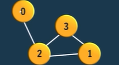

# Data Structures

- [Data Structures](#data-structures)
  - [List](#list)
  - [Arrays](#arrays)
  - [Dynamic Arrays](#dynamic-arrays)
  - [Binary tree](#binary-tree)
  - [Graph](#graph)
    - [Storing a graph](#storing-a-graph)
    - [Graph Traversals](#graph-traversals)
    - [Cycle Detection](#cycle-detection)
      - [Topological sorting](#topological-sorting)
    - [Shortest path algorithms](#shortest-path-algorithms)

Collection is a group of things. Every DS is an extension of collection.

## List

It is collection with order and no fixed length.

- ### Array

  - It is a list in which every element has an index.
  - Fast to access element [O(1)]
  - Slow insertion and deletion [O(n)]

- ### Linked List

  - In general, an element in linked list contains value and reference of next element in list

  - Insertion and deletion is easy but getting position of element is hard. There is no info
  about previous element in list.

- ### Doubly Linked List

- Same as linked list except that each element contains value and of both next and previous elements.
- This makes it easy to traverse backwards

> *TIP*: Don't forget references while inserting or deleting elements.

## Arrays

- Three types of arrays:
   1. **Static Arrays**: Size is determined at compile time
   2. **Dynamically Allocated Arrays**: Size is determined at runtime
   3. **Dynamic arrays**: Size is not fixed.

- Constant time read and write access is perquisite for arrays
- Two dimensional array can be thought of as a plane.
``
arr[x][y]: 1st index for x (row) and 2nd index for y (cols).
``

## Dynamic Arrays

- Great video on [coursera here.](https://www.coursera.org/lecture/data-structures/dynamic-arrays-EwbnV)
- At minimum follow operations:
   1. get(i) => O(1) => Returns element at location i
   1. set(i, val) => O(1) => Sets element at location i
   1. pushback(val) => O(n) => adds an element to the end. It creates a new dynamically allocated array if size = capacity
   1. remove(i) => O(n) => removes element at location i
   1. size() => O(1) => returns current filled size of dynamically allocated array
- At minimum following stores:
   1. arr: pointer/ref to dynamically allocated array
   1. capacity: size of dynamically allocated array
   1. size: Number of elements presently in dynamically allocated array
- In java, `ArrayList` is dynamic array.

## Binary tree

1. **Traversal methods**
   1. *Preorder traversal*
      - root node -> left subtree -> right subtree
   2. *Inorder traversal*
      - left subtree -> root node -> right subtree
   3. *Postorder traversal*
      - left subtree -> right subtree -> root node

> TIP: Tree is a recursive function. Most of the problems can be solved as follows:
>
> - Check if node is null (base case)
> - Do cal for left subtree (recursion)
> - Do cal for right subtree (recursion)
> - Do cal for current node
> - Merge and return the answer

## Graph

1. It is a network of **nodes** connected via **edges**.
2. Graph can be *undirected/directed* and *weighted/unweighted* depending on the type of edge

### Storing a graph

1. Adjacency list
   - List of Lists
   - e.g: `[[[0,2]], [[1,3],[1,2]], [[2,3],[2,1]], [[3,2],[3,1]]`
   - `graph[2][1][1]` will give you the 2's (node) 2nd edges destination which is 1 
2. Adjacency matrix
   - Matrix of **V*V** is created where V is number of vertices
   - Value at **aij** represents the **weight** of edge from i to j. If it is 0, i and j are not connected.
   - Diagonal of matrix are self-edges
   - In nutshell, aij = aji = weight of edge b/w i and j vertex/node
   - Row-2/Col-2 will contain all neighbors of 2 node.
3. Edge list
   - List of edges
   - e.g: `[[0,2], [1,2], [1,3], [2,3]]`
   - Best use in MST
4. 2D Matrix (Implicit Graph)
   - 2D array of size m*n is given
   - Treated as an actual graph where you have four choices to move
   - You can be asked to find if you can reach (c,d) from (a,b)

### Graph Traversals

- There is no particular starting point in graph
- Since there can be cycles we need a way to check if a given node is already visited. Usually a boolean array is used for this

1. BFS
   - RULE: Visit cur node and all its neighboring nodes and then move to next
   - Queue data structure is used
   - Equivalent (not exactly) to level order traversal of binary tree
2. DFS
   - RULE: Visit cur node and the first node of cur and then move to that node
   - Stack data structure is used (recursion)

### Cycle Detection

- *Directed Graphs:*
  - Def of cycle: If you start from a node and do a bfs/dfs and reach back to the node from any path then there is a cycle.
  - It will be closed all the time so don't worry about that
- *Undirected Graphs:*
  - Def of cycle: In an undirected graph, a cycle is a closed path that starts and ends at the same node and the last node in the path must have a parent node different from the first node.
  - In nutshell the condition is, "When your dfs encounters a child node which is visited but not your parent then there is cycle"

#### Topological sorting

- It is a linear order of vertices such that every directed edge *u -> v*, the vertex *u comes before v* in the order.
- Defined for **DAGs** only.
- It shows us dependency of one action on another. (may be gradle will use it)

### Shortest path algorithms