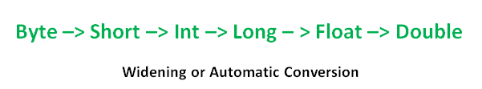

# Java

## Misc

1. String:
   - `indexOf(target, start)`, starts search from start and if not found returns -1
2. Math:
   - `log(num)`, base e
3. The operators **&**, **|**, and **^** are *bitwise logical operations* for integer types that do **and**, **or**, and **exclusive or** (respectively) on each bit position.
   - xor operator is false only when both are true
   - **~** is bitwise negation. Flips every bit
4. Java [String Formatting](https://docs.oracle.com/javase/6/docs/api/java/util/Formatter.html#syntax) `%[argument_index$][flags][width][.precision]conversion`
   - Conversion:
     - d -> integral
     - f -> floating point
     - s -> general
     - t/T -> data/time
5. Ambigious if:

```java
if <expr1> if <expr2> <stmntA> else <stmntB>
// it is equivalent to
if <expr1> { if <expr2> <stmntA> else <stmntB> }
```

## Overflow and Underflow

- Overflow: Abs value is too big for data type
- Underflow: Very very small abs value
- Integer-wraparound:
  - Integer.MAX_VALUE + 1 = Integer.MIN_VALUE
  - Integer.MIN_VALUE - 1 = Integer.MAX_VALUE
- No exception thrown on under/overflow
- 1/0 is undefined by 1.0/0.0 is infinity
- **%** is remainder operator. Gives the remainder you will get on paper
- **modulo** is another operation. Euclidien division

## Java For Loop

```java
// Both are equivalent
for ( <initialization> ; <test> ; <increment> ) {
     <body>
}

<initialization>
while ( <test> ) {
    <body>
    <increment>
}
```

## Lamda expression

- Interfaces defines behaivour
- Types of interface:
  - __Marker Interface__: No abstract methods
  - __Functional Interface__: One method (before 1.8 SAM)
  - __Normal Interface__: > One Method

Lamda Expression
 : When you create implementation of a Functional interface you can use lamda expression

```java
// functional interface annotation prevents you from creating multiple mehtods in interfaces
@FunctionalInterface
interface Consumer<T> {
   void accept(T t);
}

// in code
Consumer<String> con = (String val) -> {/*method body*/};
con.accept("Do something with value");
```

## For each method

- In Collections
- for loop uses index and enhanced for loop uses iterator are both external loop
- For each method is an internal loop
- Recenives an object of Consumer functional interface
  - Consumer has a generic method accept(T t)

```java
List<Integer> nums = Arrays.asList(1,2,3,4,5);
nums.forEach(System.out::println);

// OR
nums.forEach(n -> System.out.println(n));

// OR
Consumer<Integer> cons = new Consumer<>() {
   @Override
   public void accept(Integer n) {
      System.out.println(n);
   }
}
nums.forEach(cons);
```

## Stream API

- Lazy evalutaion
- It is always better to use Mutable list for multithreading
- Stream api => Builder Pattern
- Once you use/consume the stream you can't reuse it
  - Prevents data leakage and improves performance
  - When you call any method of Stream class you have consumed it
- stream(): Stream with single thread
- parallelStream(): Stream with multiple threads
- count(): returns number of elements in stream
- sorted(): returns stream of sorted elements
- forEach(): ...
- map(): maps elements in new Stream
- filter(): filters elements
- reduce(): reduces stream

> Predicate\<T\>
> It is a functional interface with mehtod: boolean test(T t);
> In theory, it can be used to validate objects as in Stream.filter(...)

We are only replacing values and not creating dublicates below

```java
// Creates new stream -> filters only odd nums -> sorts filtered values -> squares the elements and then prints them
Stream<Integer> nums = Collections.stream(Arrays.asList(1,34,343,2,3));
nums.stream()
   .filter(n -> n%2 == 1)
   .sorted()
   .map(n -> n * n)
   .forEach(System.out::println);

// The first argument is intial carry (called identity)
// 2nd argument is the function that you perform
// carry is basically output/return value of last function call
int sum = nums.stream()
   .reduce(0, (carry, element) -> carry + element)
```

## Type Conversion

1. **Widening or automatic conversion**:



2. **Narrowing or explicit conversion**: reverse order of above image
3. **Type Promotion in Expressions**: While evaluating expressions, the intermediate value may exceed the range of operands and hence the expression value will be promoted. Some conditions for type promotion are:
   1. Java automatically promotes each byte, short, or char operand to int when evaluating an expression.
   2. If one operand is long, float or double the whole expression is promoted to long, float, or double respectively.