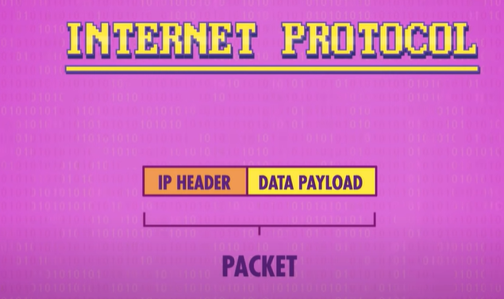
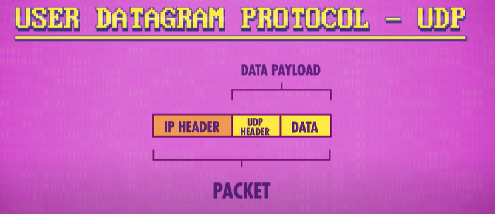
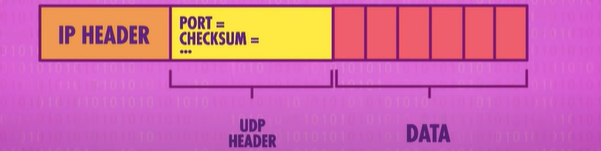
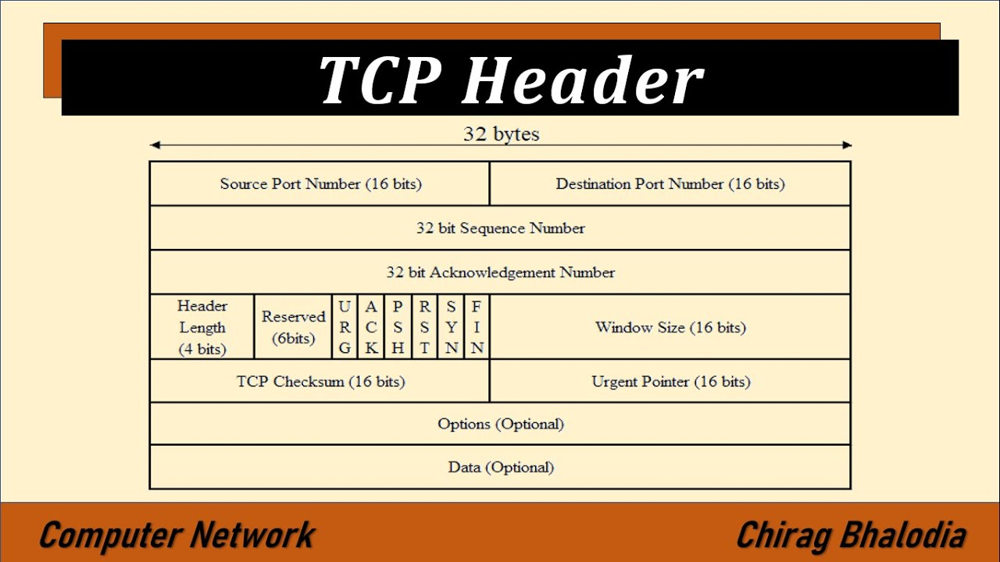
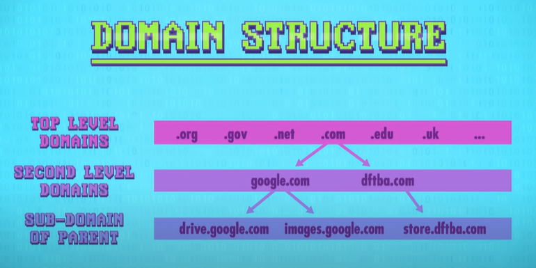
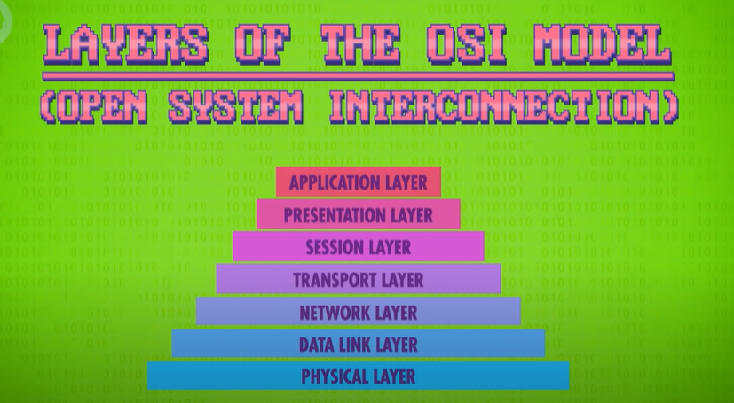

# Network CC

Videos:

- [#1 Computer Networks: The Beginning](https://youtu.be/3QhU9jd03a0)
- [#2 Computer Networks: The Internet](https://youtu.be/AEaKrq3SpW8)
- [#3 Computer Networks: The World Wide Web](https://youtu.be/guvsH5OFizE)

## Local Area Network (LAN)

- It is a relatively small networks of close-by computers
- The most famous LAN Tech is `Ethernet` and `WIFI`
  
### Ethernet

- Series of computers connected via single ethernet cable
- Each computer is assigned a unique `MAC (Media Access Control) Address`.
- The sender puts MAC address of receiver in the header.
- Everyone receives message but only that computer responds which has the header's MAC addr.

- If ethernet detects a **collison** it waits for a random short period of time. 
  - The "backing off" behavior using an exponentially growing wait time is called `Exponential Backoff`.
- To reduce collisions and improve efficiency, number of devices are reduced on shared carrier -- `Collision Domain`.
  - `Network switch` is used to connect two smaller networks. It only passes data b/w them if necessary
    - It stores the list of all MAC addresses on either side of it
    - Internet means a bunch of smaller inter-connected networks. It works on same principle

---

- WIFI and Ethernet both have unique MAC address
- In ethernet, carrier is copper wire while in wifi it is air
- The rate at which a carrier can transmit data is called its `Bandwidth`
- Other than LAN there are `wide area network (WAN)` and `metropolitan area network (MAN)` that cover larger geographic areas. Some WANs and MANs connect many smaller LANs and WANs.

## Routing

### Circuit Switching

- Dedicated single route from A to B
- For example old telephone network, sender asked the customer care to join him with other recevier

### Message Switching

- Several stops b/w A to B.
- Each stop knows where to send the message given the destination address. More reliable and efficient.
- The hops/jumps a message takes along the route -> `Hop Count`
- `Hop Limit` ensures that we are not running in circles

### Packet Switching

- Big transmitions are choped into many small pieces called `Packets`
- Chopping up date into small packets and passing these along flexible routes with spare capacity is very efficient. It is what the whole internet runs on today. This routing approach is called `packet switching`.
- **ARPANET** was world's first packet switched network. It is the ancestor to the modern internet

- Each packet has a destination address on it. The format is defined by `IP (Internet Protocol)`. Every device connected to internet gets an IP Addr.
- Network routers constantly try to ensure speedy and reliable delivery which is called `Congestion Control`.
- Sometimes packets take different routes and thus receiver can receive them out of order. To address this issue some special transmission protocals run on top IP e.g `TCP/IP`.

---

> `tracert URL` utitlity in windows helps you to trace route of a packet from your computer to the server.

---

## IP

- All packets have to conform to a standard called the IP (Internet Protocol)
- IP is a very low level protocol.
- There is only destination address in the packet's header. So computer on receiving packet will be unable to determine the receiving application
  - Packet's header is just the metadata stored in front of the payload

## UDP

- UDP (User Diagram Protocal) is an example of protocol built on top of IP that allows some more functionality
- UDP has its own header which contains PORT as well CHECKSUM.
  - PORT is simply a number that helps a computer to determine target app
  - CHECKSUM is the sum of data present in packet. It helps in detection of data loss
- So IP gets the packet to right computer but UDP gets the packet to the right p>rogram running on that computer
- UDP doesn't offer any mechanism to fix the data. It just alert the receiving program about it

## TCP

- TCP (Transmission Control Protocol) is another protocol built on top of IP. This protocol ensures that packets are received by receiver correctly.
- It also posses PORT and CHECKSUM. However it provides some other functionalities as well
  - Every TCP packet is given a seq. number
  - When receiver receives the packet and verfies its checksum it needs to send an ACK or acknowledegement to sender.
  - If sender doesn't receive the ACK it resends the same packet

## DNS Server

- DNS (Domain Name System) is like spreadsheet that maps b/w domain names and their ip addresses
  - This mapping is stored in a tree data structure as follows
  

## OSI Model

Layers Of The OSI Model:

1. Physical Layer: Radio Waves, electrical wires
2. DataLink Layer: MAC Addresses, Collision Detection, Exponential Backoff
3. Network Layer: Switching and Routing
4. Transport Layer: UDP and TCP, Error detection
5. Session Layer: Protocols like UDP, TCP are used to open a session, transmit data and then close the session
6. Presentation Layer: ...
7. Application Layer: ...

## WWW (World Wide Web)

- WWW runs on top of internet just like insta, whatsapp,skype, etc.
- It is a huge distributed application running on millions of servers, accessed via special program called Browser
- Fundamental building block of web is a single page with links (called `Hyperlinks`) to other pages.
- Text containing hyperlinks is called `Hypertext`
- Each hypertext is given a unique address called `URL (Uniform Resource Locator)`.

- When you type **google.com/images** in browser following things happen:
  - DNS Lookup: Browser retrives the IP addr of google.com from DNS Server.
  - Making Connection: Your browser now establishes a TCP connection with a computer running a special piece of software called `Web Server`. Standard port to connect is port 80
  - GET: Browser requests hypertext of requested page via protocol HTTP

> Web page hypertext is stored and sent as plain text usually encoded in ASCII or UTF-16

> Net Neutraility is the principle that all packets on the internet should be treated equally.

Throttled
: Intentionally given less bandwidth and low  er priority